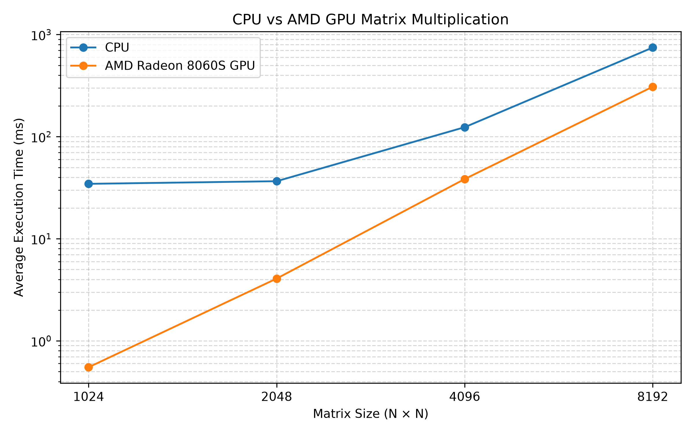
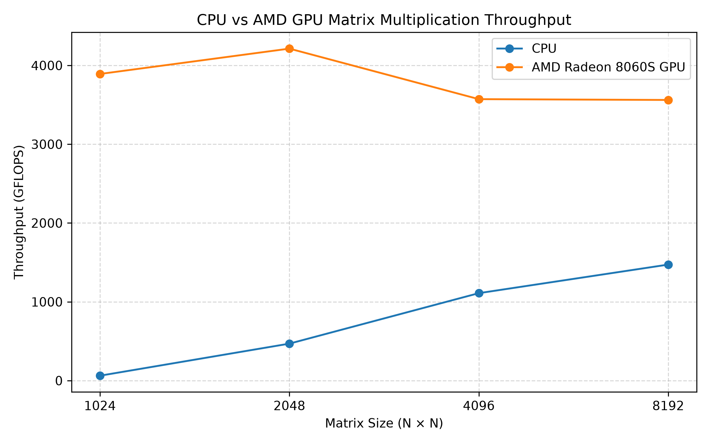
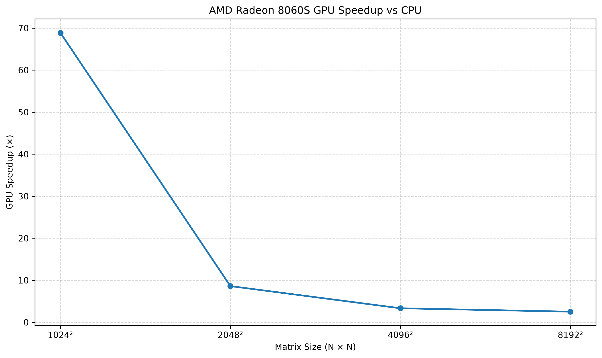

# AMD GPU Matrix Multiplication Benchmark

A CPU vs AMD GPU performance benchmark using **PyTorch + ROCm** on an AMD Ryzen AI Max+ 392 system with integrated **AMD Radeon 8060S Graphics**.

The project measures matrix multiplication performance across multiple matrix sizes and evaluates execution time, GFLOPS, GPU speedup, and numerical accuracy.

---

## Overview

This project was created to explore practical GPU acceleration using the AMD ROCm software stack.

The benchmark compares:

- CPU matrix multiplication
- AMD GPU matrix multiplication
- Execution time
- CPU and GPU throughput
- GPU speedup relative to CPU
- Numerical accuracy between CPU and GPU results
- Performance scaling with increasing matrix size

The benchmark currently uses PyTorch's matrix multiplication implementation through the ROCm/HIP backend.

---

## Hardware

| Component | Specification |
|---|---|
| System | AMD Ryzen AI Max+ 392 |
| CPU | AMD Ryzen AI Max+ 392 |
| CPU Cores | 12 cores / 24 threads |
| GPU | AMD Radeon(TM) 8060S Graphics |
| GPU Type | Integrated GPU |
| GPU Architecture | AMD RDNA-based |
| Memory | Shared system memory |

### CPU Configuration

The system exposes:

```text
CPU(s):                  24
Core(s) per socket:     12
Thread(s) per core:      2
```

PyTorch reports:

```text
CPU threads:             24
CPU inter-op threads:    24
```

---

## Software Stack

| Component | Version |
|---|---|
| OS Environment | Ubuntu / WSL2 |
| Python | Python 3.x |
| PyTorch | 2.13.0+rocm10.0.0 |
| HIP | 7.15.26333 |
| ROCm | ROCm 10.x |
| GPU Backend | ROCm / HIP |
| Visualization | Matplotlib |

GPU detection:

```text
GPU available: True
GPU: AMD Radeon(TM) 8060S Graphics
GPU capability: (11, 5)
```

---

# Objective

The primary objective is to understand how a modern AMD integrated GPU performs on a highly parallel workload compared with the CPU.

Matrix multiplication was selected because it is a fundamental workload in:

- Machine learning
- Deep learning
- Computer vision
- Scientific computing
- Robotics
- Signal processing
- Numerical simulation
- GPU computing

The benchmark also serves as the first stage of a larger exploration of the AMD ROCm ecosystem.

---

# Benchmark Methodology

The benchmark evaluates four matrix sizes:

```text
1024 × 1024
2048 × 2048
4096 × 4096
8192 × 8192
```

Each benchmark uses:

```text
Warm-up iterations:      5
Benchmark iterations:   20
```

For every matrix size:

1. Random matrices are generated on the CPU.
2. The same matrices are copied to the AMD GPU.
3. CPU matrix multiplication is performed.
4. The GPU is warmed up.
5. GPU matrix multiplication is executed.
6. GPU execution is synchronized before timing.
7. CPU and GPU execution times are recorded.
8. CPU and GPU results are compared.
9. GFLOPS are calculated.
10. GPU speedup is calculated.
11. Results are written to a CSV file.

---

# Benchmark Pipeline

```text
                 Random Matrices
                       │
                       ▼
              ┌─────────────────┐
              │   CPU Matrices  │
              │    A × B        │
              └────────┬────────┘
                       │
                       │ Copy
                       ▼
              ┌─────────────────┐
              │   AMD GPU       │
              │    A × B        │
              └────────┬────────┘
                       │
                       ▼
              ┌─────────────────┐
              │ Timing + Sync   │
              └────────┬────────┘
                       │
                       ▼
              ┌─────────────────┐
              │ Result Compare  │
              └────────┬────────┘
                       │
                       ▼
              ┌─────────────────┐
              │ GFLOPS / Speedup│
              └────────┬────────┘
                       │
                       ▼
              ┌─────────────────┐
              │   CSV Results   │
              └─────────────────┘
```

---

# Results

The latest benchmark produced the following results.

| Matrix Size | CPU Avg (ms) | GPU Avg (ms) | CPU GFLOPS | GPU GFLOPS | GPU Speedup |
|---:|---:|---:|---:|---:|---:|
| 1024² | 39.62 | 0.575 | 54.20 | 3734.10 | **68.90×** |
| 2048² | 38.60 | 4.483 | 445.04 | 3832.48 | **8.61×** |
| 4096² | 127.21 | 38.11 | 1080.38 | 3606.00 | **3.34×** |
| 8192² | 755.65 | 299.45 | 1455.05 | 3671.73 | **2.52×** |

> These values are measurements from one benchmark run on the development system. Performance can vary depending on system load, power mode, thermals, memory behavior, driver/software versions, and background processes.

---

# GPU Performance

Measured GPU throughput:

| Matrix Size | GPU Throughput |
|---:|---:|
| 1024² | 3734.10 GFLOPS |
| 2048² | 3832.48 GFLOPS |
| 4096² | 3606.00 GFLOPS |
| 8192² | 3671.73 GFLOPS |

The measured throughput remains in the approximate range of:

```text
3.6 – 3.8 TFLOPS
```

for the tested workloads.

---

# GPU Speedup

The measured CPU-to-GPU speedup was:

```text
1024 × 1024  →  68.90×
2048 × 2048  →   8.61×
4096 × 4096  →   3.34×
8192 × 8192  →   2.52×
```

The speedup is calculated as:

```text
GPU Speedup = CPU Average Time / GPU Average Time
```

The large speedup at 1024² should not be interpreted as a fixed hardware advantage across all workloads. Benchmark behavior changes with matrix size, CPU utilization, memory behavior, GPU utilization, and other system effects.

---

# Numerical Accuracy

The CPU and GPU outputs are compared using PyTorch's `torch.allclose()`:

```python
torch.allclose(
    cpu_result,
    gpu_result,
    rtol=1e-3,
    atol=1e-3
)
```

All tested matrix sizes passed the validation:

```text
1024²  → True
2048²  → True
4096²  → True
8192²  → True
```

Maximum absolute error from the latest benchmark:

| Matrix Size | Maximum Absolute Error |
|---:|---:|
| 1024² | 2.8992 × 10⁻⁴ |
| 2048² | 5.1880 × 10⁻⁴ |
| 4096² | 9.6130 × 10⁻⁴ |
| 8192² | 2.5940 × 10⁻³ |

Small numerical differences are expected because floating-point matrix multiplication can produce slightly different results depending on hardware, implementation, and the order in which floating-point operations are performed.

---

# GFLOPS Calculation

For square matrix multiplication:

```text
C = A × B
```

the approximate number of floating-point operations is:

```text
FLOPs = 2 × N³
```

where `N` is the matrix dimension.

Throughput is calculated as:

```text
GFLOPS = FLOPs / execution_time / 10⁹
```

For example, for a matrix of size `1024 × 1024`:

```text
FLOPs = 2 × 1024³
```

The measured execution time is then used to calculate the effective throughput.

---

# GPU Timing

GPU operations are asynchronous.

Therefore, directly measuring:

```python
start = time.perf_counter()

C = A_gpu @ B_gpu

end = time.perf_counter()
```

would not provide a reliable measurement of the actual GPU execution time.

The benchmark therefore uses synchronization:

```python
torch.cuda.synchronize()

start = time.perf_counter()

C_gpu = A_gpu @ B_gpu

torch.cuda.synchronize()

end = time.perf_counter()
```

This ensures that the GPU workload has completed before the end timestamp is recorded.

---

# Warm-up

GPU warm-up iterations are performed before collecting benchmark measurements:

```text
Warm-up iterations = 5
```

This helps reduce the effect of initial execution overhead and allows the GPU computation path to reach a more stable state before measurements are collected.

---

# Project Structure

```text
amd-gpu-benchmark/
│
├── README.md
│
├── src/
│   ├── benchmark.py
│   ├── device_test.py
│   ├── matmul_test.py
│   ├── timing_test.py
│   └── warmup_test.py
│
├── scripts/
│   ├── plot_results.py
│   ├── plot_gflops.py
│   └── plot_speedup.py
│
├── results/
│   └── benchmark.csv
│
└── plots/
    ├── performance_comparison.png
    ├── gflops_comparison.png
    └── speedup_comparison.png
```

---

# Source Code

## Main Benchmark

The main benchmark is located at:

```text
src/benchmark.py
```

Run it using:

```bash
python src/benchmark.py
```

The script automatically:

- Detects the AMD GPU
- Reports PyTorch and HIP versions
- Benchmarks multiple matrix sizes
- Performs CPU/GPU validation
- Calculates performance metrics
- Saves the results to CSV

---

# Generating Performance Plots

The project includes three plotting scripts.

### Execution Time

```bash
python scripts/plot_results.py
```

Output:

```text
plots/performance_comparison.png
```

### GFLOPS

```bash
python scripts/plot_gflops.py
```

Output:

```text
plots/gflops_comparison.png
```

### GPU Speedup

```bash
python scripts/plot_speedup.py
```

Output:

```text
plots/speedup_comparison.png
```

---

# Performance Visualization

## CPU vs GPU Execution Time



---

## CPU vs GPU GFLOPS



---

## GPU Speedup



---

# CSV Output

Benchmark results are stored in:

```text
results/benchmark.csv
```

The CSV contains:

```text
matrix_size
cpu_average_ms
cpu_median_ms
cpu_minimum_ms
gpu_average_ms
gpu_median_ms
gpu_minimum_ms
cpu_gflops
gpu_gflops
gpu_speedup
results_match
max_absolute_error
```

This makes it possible to perform additional analysis without rerunning the benchmark.

---

# Installation

## 1. Clone the Repository

```bash
git clone https://github.com/ArjunD08/amd-gpu-benchmark.git
cd amd-gpu-benchmark
```

## 2. Create a Python Environment

```bash
python3 -m venv ai-rocm
```

Activate it:

```bash
source ai-rocm/bin/activate
```

## 3. Verify PyTorch and ROCm

Run:

```bash
python -c "import torch; print(torch.__version__); print(torch.version.hip); print(torch.cuda.is_available())"
```

Expected output should indicate that:

```text
PyTorch: 2.13.0+rocm10.0.0
HIP: 7.15.26333
GPU available: True
```

The exact versions may differ depending on the installed ROCm/PyTorch stack.

---

# Running the Project

After activating the environment:

```bash
python src/benchmark.py
```

Example:

```text
============================================================
AMD GPU Matrix Multiplication Benchmark
============================================================

PyTorch version: 2.13.0+rocm10.0.0
HIP version: 7.15.26333
GPU available: True
GPU: AMD Radeon(TM) 8060S Graphics
```

After completion:

```text
Results saved to: results/benchmark.csv
```

---

# Development Environment

This project was developed using:

```text
Windows
   │
   └── WSL2
         │
         └── Ubuntu
               │
               ├── Python
               ├── PyTorch
               ├── ROCm
               └── AMD Radeon 8060S
```

The Linux environment provides the development workflow used for ROCm experimentation.

---

# Technologies Used

### GPU Computing

- AMD ROCm
- HIP
- PyTorch
- GPU synchronization
- GPU benchmarking

### Programming

- Python
- NumPy / PyTorch tensor operations
- CSV data processing

### Visualization

- Matplotlib
- Performance plots

### Development

- Ubuntu
- WSL2
- Bash
- Git
- GitHub
- VS Code

---

# Engineering Concepts Demonstrated

This project demonstrates practical experience with:

- CPU vs GPU benchmarking
- Heterogeneous computing
- GPU acceleration
- Parallel computing
- Matrix multiplication
- Floating-point computation
- GPU synchronization
- Benchmark methodology
- Performance measurement
- GFLOPS calculation
- Numerical validation
- Data logging
- Performance visualization
- Linux command-line workflows
- Git version control
- AMD ROCm

---

# Limitations

This benchmark should not be treated as a complete characterization of the Radeon 8060S.

The measured results depend on:

- System workload
- CPU scheduling
- GPU utilization
- Thermal conditions
- Power management
- Memory bandwidth
- Shared-memory behavior
- ROCm version
- PyTorch version
- Driver configuration
- Matrix size
- Benchmark methodology

The CPU and GPU also use different execution models, so a single matrix multiplication benchmark cannot represent all real-world workloads.

---

# Future Work

The next stage of this project will move beyond basic PyTorch benchmarking toward lower-level ROCm performance analysis.

Planned experiments include:

### ROCm Profiling

Use ROCm profiling tools to investigate:

- Kernel execution time
- GPU occupancy
- Memory operations
- Kernel launches
- CPU/GPU synchronization
- Compute utilization

### Precision Comparison

Benchmark:

```text
FP32
FP16
BF16
```

and compare:

- Execution time
- Throughput
- Numerical error
- Memory usage

### CPU Scaling

Investigate performance using different CPU thread counts:

```text
1
2
4
8
12
16
24
```

This will help determine how CPU parallelism affects the comparison.

### Memory Bandwidth

Create dedicated memory bandwidth tests to investigate whether workloads are:

```text
Compute-bound
```

or

```text
Memory-bound
```

### Custom HIP Kernels

Implement matrix multiplication directly using HIP C++ rather than relying exclusively on PyTorch.

Potential progression:

```text
PyTorch
   ↓
HIP C++
   ↓
Naive Matrix Multiplication
   ↓
Tiled Matrix Multiplication
   ↓
Shared Memory Optimization
   ↓
Performance Profiling
```

### ML Workloads

Extend the benchmark toward workloads more representative of AI applications:

- Convolution
- Transformer operations
- Attention
- GEMM
- Vector operations
- CNN inference
- Small LLM inference

---

# Project Roadmap

```text
Phase 1
───────
CPU vs GPU Matrix Multiplication
        │
        ▼
Phase 2
───────
Benchmark Visualization
        │
        ▼
Phase 3
───────
ROCm Profiling
        │
        ▼
Phase 4
───────
Precision & Memory Benchmarking
        │
        ▼
Phase 5
───────
Custom HIP Kernels
        │
        ▼
Phase 6
───────
GPU Kernel Optimization
        │
        ▼
Phase 7
───────
AI/ML Workload Benchmarking
```

---

# Version History

## v0.1 — Matrix Benchmark

Initial project milestone.

Implemented:

- CPU matrix multiplication benchmark
- AMD GPU matrix multiplication benchmark
- ROCm/PyTorch GPU detection
- GPU warm-up
- Synchronized GPU timing
- CPU/GPU result validation
- GFLOPS calculation
- GPU speedup calculation
- CSV result generation
- Performance visualization
- Speedup visualization

Git tag:

```text
v0.1-matrix-benchmark
```

---

# Author

**Arjun D08**

Mechatronics Engineer interested in:

- Embedded Systems
- Robotics
- GPU Computing
- AI/ML
- Computer Vision
- AMD ROCm
- Hardware Acceleration
- CAD & Mechanical Design

GitHub:

https://github.com/ArjunD08

---

# License

This project is intended for educational, experimental, and portfolio purposes.

A license can be added as the project evolves.
